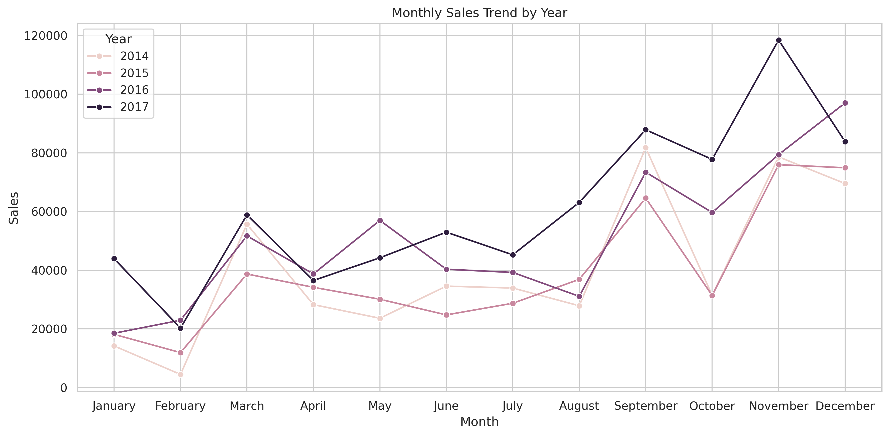
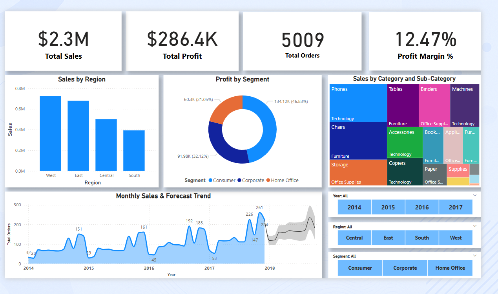

# 🛒 Superstore Sales Analysis

An end-to-end data analysis and visualization project using **Excel**, **SQL (MySQL)**, **Python**, and **Power BI** based on the Superstore retail dataset. To support data-driven decisions, this project explores regional sales trends, product profitability, customer value, and time-based patterns.

---

## 📊 Project Goals

- Clean and explore Superstore sales data across regions, categories, and customers.
- Perform sales and profit analysis using SQL and Python.
- Visualize key business metrics using Power BI and Excel dashboards.
- Practice and showcase multi-tool data analysis workflow.

---

## 🧰 Tools Used

| Tool     | Purpose                                      |
|----------|----------------------------------------------|
| Excel    | Data cleaning, PivotTables, Excel dashboard  |
| MySQL    | Aggregations, grouping, and querying insights|
| Python   | Advanced EDA and custom visualizations       |
| Power BI | Interactive dashboard for business reporting |

---

## 📁 Project Structure

<pre>
Superstore-Sales-Analysis/
├── visuals/                            # Saved plots and dashboard screenshots
│   ├── monthly_sales_trend.png
│   ├── category_profit_bar.png
│   └── powerbi_dashboard_preview.png
│
├── Superstore_Cleaned.csv             # Cleaned dataset used across tools
├── Superstore_Excel_Analysis.xlsx     # PivotTables and Excel dashboard
├── Superstore_SQL_Queries.sql         # SQL analysis queries
├── Superstore_Python_Analysis.ipynb   # Python notebook with charts and insights
├── Superstore_PowerBI_Dashboard.pbix  # Power BI dashboard file
└── README.md                          # Project overview and instructions
</pre>

---

## 🔍 Key Insights

- 🧭 **West region** had the highest total sales but also significant discounting.
- 📦 **Technology** performed well in sales, while **Office Supplies** had better profit margins.
- 📆 Sales spiked in **November–December**, likely due to seasonal promotions.
- 💰 Top 10 customers contributed significantly to overall revenue.
- 📉 Some sub-categories showed high discounts and negative profits, indicating areas for pricing review.

---

## 📈 Sample Visuals

### 🔹 Monthly Sales Trend by Year

### 🔹 Profit by Product Category

### 🔹 Heatmap – Profit by Category and Region

### 🔹 Power BI Dashboard Overview

---

## 📥 Download Power BI Dashboard

If GitHub doesn't support `.pbix` preview, you can [**download the dashboard here**](https://drive.google.com/your-powerbi-link).

---

## 🚀 How to Run This Project

1. Clone or download the repository
2. Open `Superstore_Cleaned.csv` in:
   - Excel for dashboarding
   - MySQL for querying via `Superstore_SQL_Queries.sql`
   - Power BI for report visuals
   - Python for analysis with `Superstore_Python_Analysis.ipynb`
3. Review visuals inside the `visuals/` folder or generate new ones

---

## ✍️ Author

**Your Name**  
Aspiring Data Analyst  
[LinkedIn](#) | [Portfolio](#)

---

## 📌 Resume Use Example

> “Built a complete Superstore sales analytics project using Excel, SQL, Python, and Power BI. Delivered business-ready dashboards and insights across customer segments, product categories, and regions.”

